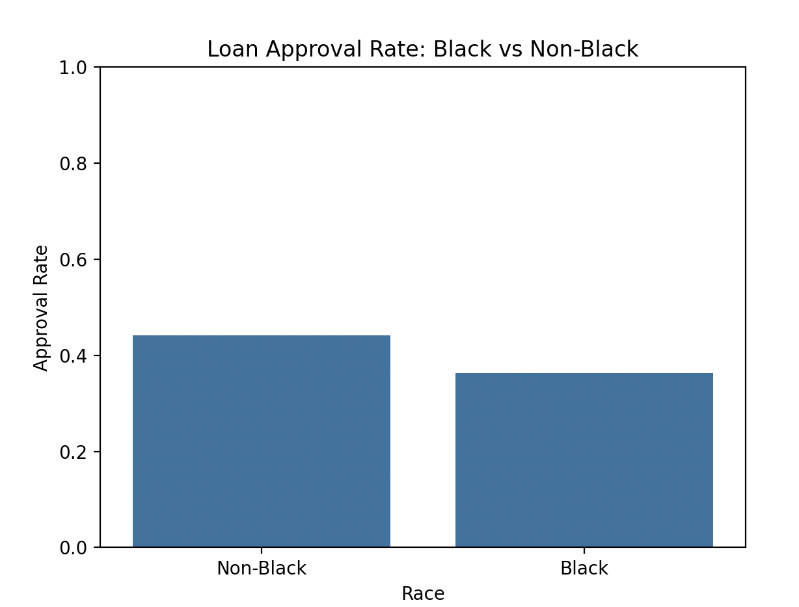

# AI Bias Bounty Hackathon `AIDONTKNOW`

#### How to run the project

1. Install the require library. *  
`
pandas
matplotlib
numpy
seaborn
catboost
scikit-learn
fairlearn
aif360
`
2. Clone the repository. *  
3. Type `python3 loan_model.py` in your terminal. 

# 🔍 What we have found
## Bias detection with AIF360

> *__Disclaimer__*
> | DI |  |
> |--|--|
> | 1 | No bias |
> | <1 | Has Bias against topic |
> | >1 | Has Bias against the opposite of topic |  
> 
> | SPD | |
> |--|--|
> | 0 | No bias |
> | <0 | Has Bias against topic |
> | >1 | Has Bias against the opposite of topic |

#### Bias against Black

Disparate Impact: 0.8203400899931298  
Statistical Parity Difference: -0.07939615454315352

#### Bias against Non-White

Disparate Impact: 0.8607889732105376  
Statistical Parity Difference: -0.06360423910404034

#### Bias against Non-Native American

Disparate Impact: 1.0141580860084796  
Statistical Parity Difference: 0.006024717450416883

#### Bias against Non-binary

Disparate Impact: 0.7727227912835603  
Statistical Parity Difference: -0.0985246815779034

#### Bias against Unemployed

Disparate Impact: 0.8914381276775055  
Statistical Parity Difference: -0.04948203217842578

#### Bias against Non-White with Criminal Record

Disparate Impact: 0.7835102201257862  
Statistical Parity Difference: -0.07339418976545842

#### Bias against Non-High Credit Score

Disparate Impact: 0.6506098087570649  
Statistical Parity Difference: -0.18209597159360852

#### Bias against Non-High Income

Disparate Impact: 0.6197659385649466  
Statistical Parity Difference: -0.17286558923242212

#### Bias against Non-High Income with Criminal Record

Disparate Impact: 0.4472864404000656  
Statistical Parity Difference: -0.18477814015950886

---
After that we decide to use fairlearn model to evaluate fairness the sensitive cases ('Gender' and 'Race')  
*Before Mitigation*

*After Mitigation with ThresholdOptimizer from fairlearn* 

